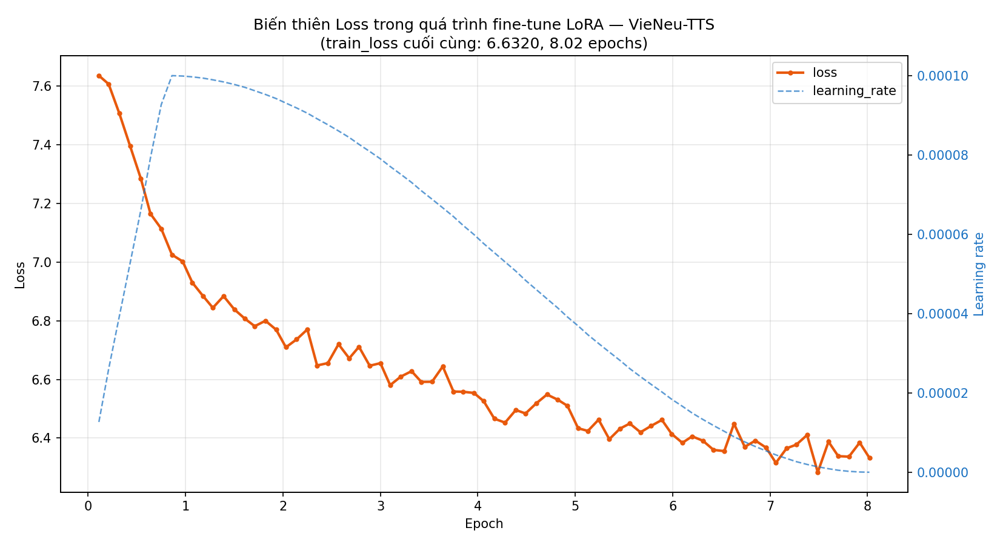

Mô hình chỉ phục vụ nghiên cứu học tập, không được sử dụng vào mục đích doanh nghiệp

<div align="center">

# 🎙️ VieNeu-TTS Demo

### Ứng dụng demo giọng nói AI — Fine-tuned với LoRA

[](https://python.org)
[](https://gradio.app)
[](https://github.com/capleaf/viNeuTTS)
[](LICENSE)
[]()

---

**Ứng dụng chạy local** để tạo giọng nói AI từ văn bản tiếng Việt,  
sử dụng model VieNeu-TTS đã được fine-tune bằng kỹ thuật LoRA.

[Bắt đầu](#-cài-đặt) · [Tính năng](#-tính-năng) · [Cấu hình](#%EF%B8%8F-cấu-hình) · [Xử lý sự cố](#-xử-lý-sự-cố)

</div>

---

## 🔊 Audio mẫu

- [Nghe hoặc tải audio TTS mẫu](outputs/tts_20260726_111550.wav)

## 📉 Biểu đồ loss



---

## ✨ Tính năng

| Tính năng | Mô tả |
|---|---|
| 🎨 **Giao diện Premium** | Dark theme với hiệu ứng gradient, glassmorphism, và micro-animations |
| 📋 **Tab Giới thiệu** | Hiển thị thông số huấn luyện model + biểu đồ loss (nếu có) |
| 🎤 **Tab Tạo giọng nói** | Nhập văn bản → sinh audio → phát lại ngay trong app |
| 📂 **Mở File Explorer** | Mở thư mục chứa file audio vừa tạo (Windows/macOS/Linux) |
| 🛡️ **Xử lý lỗi** | Xử lý graceful mọi trường hợp: model lỗi, text rỗng, text quá dài,... |
| ⚡ **Tối ưu hiệu suất** | Model chỉ load 1 lần khi khởi động, không load lại mỗi lần tạo audio |

---

## 📁 Cấu trúc dự án

```
vieneu-tts-demo/
├── 📄 app.py                     # File chính — chạy ứng dụng Gradio
├── ⚙️ config.py                  # Cấu hình model, đường dẫn, thông số
├── 📦 requirements.txt           # Danh sách thư viện Python
├── 📋 README.md                  # Bạn đang đọc file này
├── 📜 LICENSE                    # MIT License
├── 🖼️ assets/
│   └── loss_chart.png           # ⬅️ CHÈN ảnh biểu đồ loss vào đây
├── 🤖 models/
│   └── merged_model/            # ⬅️ CHÈN merged_model vào đây
├── 🔊 reference/
│   └── ref_audio.wav            # ⬅️ CHÈN file audio tham chiếu vào đây
└── 📂 outputs/                   # File audio sinh ra (tự tạo)
```

---

## 🚀 Cài đặt

### Yêu cầu hệ thống

- **Python** 3.9 trở lên
- **RAM** ≥ 8 GB
- **GPU** (khuyến nghị) — có GPU sẽ sinh audio nhanh hơn nhiều
- **Hệ điều hành**: Windows, macOS, hoặc Linux

### Bước 1: Clone repository

```bash
git clone https://github.com/thang18zz/vieneu-tts-demo.git
cd vieneu-tts-demo
```

### Bước 2: Tạo môi trường ảo (khuyến nghị)

```bash
# Tạo virtual environment
python -m venv .venv

# Kích hoạt
# Windows:
.venv\Scripts\activate
# macOS/Linux:
source .venv/bin/activate
```

### Bước 3: Cài đặt thư viện

```bash
pip install -r requirements.txt

# Cài thêm VieNeu-TTS (theo hướng dẫn của model)
pip install vieneu
```

### Bước 4: Chèn model và tài nguyên

> ⚠️ **Quan trọng**: Bạn cần có sẵn model đã fine-tune từ quá trình huấn luyện.

1. **Merged model** → Copy thư mục `merged_model/` vào `models/`
2. **Audio tham chiếu** → Copy file `ref_audio.wav` vào `reference/`
3. **Văn bản tham chiếu** → Tạo file text cùng tên với file audio (ví dụ `ref_audio.txt`) trong thư mục `reference/`, nội dung là chuỗi văn bản khớp 100% với tiếng trong file audio.
4. **Biểu đồ loss** *(tuỳ chọn)* → Copy ảnh vào `assets/loss_chart.png`

### Bước 5: Cập nhật cấu hình

Mở file `config.py` và chỉnh sửa thông số hiển thị:

```python
# Chỉnh lại thông số huấn luyện cho đúng
MODEL_INFO = {
    "Tên model": "My Voice — VieNeu-TTS Fine-tuned",
    "Số bước huấn luyện (max_steps)": "5000",
    # ... (chỉnh các thông số khác)
}
```

### Bước 6: Chạy ứng dụng 🎉

```bash
python app.py
```

Ứng dụng sẽ tự động mở trình duyệt tại: **http://127.0.0.1:7860**

---

## ⚙️ Cấu hình

Tất cả cấu hình nằm trong file [`config.py`](config.py):

| Biến | Mô tả | Mặc định |
|---|---|---|
| `MERGED_MODEL_DIR` | Đường dẫn thư mục model | `models/merged_model` |
| `LOSS_CHART_IMAGE` | Đường dẫn ảnh biểu đồ loss | `assets/loss_chart.png` |
| `REF_AUDIO_PATH` | File audio tham chiếu | `reference/ref_audio.wav` |
| `OUTPUT_DIR` | Thư mục lưu audio sinh ra | `outputs` |
| `MODEL_INFO` | Dict thông số hiển thị Tab 1 | *(chỉnh theo model)* |

---

## 🎯 Cách sử dụng

### Tab 1 — Giới thiệu

- Xem thông số huấn luyện model (bảng 2 cột)
- Xem biểu đồ loss (nếu đã chèn ảnh)

### Tab 2 — Tạo giọng nói

1. Nhập văn bản tiếng Việt vào ô input
2. Bấm **"🚀 Tạo giọng nói"**
3. Chờ xử lý → audio tự động phát
4. Bấm **"📂 Mở thư mục chứa file"** để xem file đã lưu

> 💡 File audio được lưu tự động tại `outputs/tts_YYYYMMDD_HHMMSS.wav`

---

## 🔧 Xử lý sự cố

<details>
<summary><b>❌ "Không tìm thấy thư mục model"</b></summary>

Kiểm tra:
- Đã copy `merged_model/` vào `models/` chưa?
- Đường dẫn trong `config.py` có đúng không?
- Thư mục `merged_model/` có chứa đủ file model không?

</details>

<details>
<summary><b>❌ "Không tìm thấy thư viện vieneu"</b></summary>

```bash
pip install vieneu
```

Nếu vẫn lỗi, kiểm tra xem bạn đang dùng đúng virtual environment.

</details>

<details>
<summary><b>❌ "CUDA out of memory"</b></summary>

- Đóng các ứng dụng khác đang dùng GPU
- Thử chạy với CPU: thêm `CUDA_VISIBLE_DEVICES="" python app.py`
- Hoặc giảm độ dài văn bản input

</details>

<details>
<summary><b>⚠️ Nút "Mở thư mục" không hoạt động</b></summary>

Nút này **chỉ hoạt động khi chạy app trên máy local**. Nếu chạy trên server/cloud (Colab, HF Spaces,...) thì tính năng này sẽ không khả dụng. Đường dẫn file sẽ được hiển thị trong ô trạng thái.

</details>

<details>
<summary><b>🐛 App khởi động nhưng model không load</b></summary>

App được thiết kế để **vẫn khởi động** ngay cả khi model lỗi. Tab 1 sẽ hoạt động bình thường, Tab 2 sẽ hiển thị thông báo lỗi rõ ràng.

</details>

---

## 🏗️ Kiến trúc

```
┌─────────────────────────────────────────────┐
│                  app.py                      │
│  ┌──────────────────────────────────────┐   │
│  │         Gradio UI (Dark Theme)        │   │
│  │  ┌──────────┐  ┌──────────────────┐  │   │
│  │  │  Tab 1   │  │     Tab 2        │  │   │
│  │  │ Giới     │  │ • Text Input     │  │   │
│  │  │ thiệu    │  │ • Generate Btn   │  │   │
│  │  │ • Info   │  │ • Audio Player   │  │   │
│  │  │ • Loss   │  │ • Open Folder    │  │   │
│  │  └──────────┘  └──────────────────┘  │   │
│  └──────────────────────────────────────┘   │
│                     │                        │
│              ┌──────┴──────┐                 │
│              │  config.py  │                 │
│              └──────┬──────┘                 │
│                     │                        │
│  ┌──────────┐  ┌────┴─────┐  ┌───────────┐ │
│  │ models/  │  │reference/│  │ outputs/   │ │
│  │merged_   │  │ref_audio │  │ tts_*.wav  │ │
│  │model     │  │.wav      │  │            │ │
│  └──────────┘  └──────────┘  └───────────┘ │
└─────────────────────────────────────────────┘
```

---

## 📄 Giấy phép

Dự án được phân phối dưới giấy phép [MIT](LICENSE).

---

## 🙏 Ghi công

- **[VieNeu-TTS](https://github.com/capleaf/viNeuTTS)** — Model TTS tiếng Việt gốc
- **[Gradio](https://gradio.app)** — Framework giao diện web cho ML
- **[LoRA](https://arxiv.org/abs/2106.09685)** — Kỹ thuật fine-tuning hiệu quả

---

<div align="center">

Được tạo với ❤️ bởi [thang18zz](https://github.com/thang18zz)

</div>
